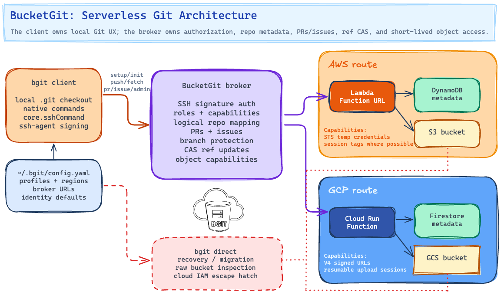

# bgit

`bgit` is a Git CLI for repositories stored directly in cloud buckets. It keeps
normal `.git` checkouts on disk, so developers can use familiar local Git
workflows, while BucketGit stores repository objects and refs in GCS or S3 and
coordinates access through a lightweight broker.

Use it when you want Git repositories in cloud object storage without running a
Git server.

## Project

- Homepage: https://bucketgit.com/
- Author: Dennis Vink
- License: MIT

## Install

With Homebrew:

```bash
brew tap bucketgit/bgit
brew install bgit
```

Or build from source:

```bash
git clone https://github.com/bucketgit/bgit.git
cd bgit
go build -o bgit .
```

Check the installed version:

```bash
bgit --version
```

## How BucketGit Works

BucketGit has two layers:

- A normal local Git checkout on your machine.
- A broker-backed repository stored directly in GCS, S3, or a local broker
  object backend.

The broker handles repository mapping, roles, SSH-key authorization, pull
requests, issues, branch protection, and short-lived object-transfer
capabilities. Developers do not need long-lived bucket credentials for everyday
clone, fetch, pull, push, review, or web browsing flows.

Direct bucket access still exists under `bgit direct` for recovery, migration,
and low-level inspection. It is not the normal user workflow.



## Quickstart

Set up BucketGit for one or more cloud profiles:

```bash
bgit setup
```

`bgit setup` is the interactive broker setup and management tool. It discovers
GCP and AWS profiles, lets you choose regions, creates or updates brokers,
imports owner SSH keys, manages users and teams, and writes global configuration
to `~/.bgit/config.yaml`. Set `BGIT_HOME` to use another BucketGit config
directory.

For local hosting, `bgit clone file://repo.git`, `bgit clone s3://repo.git`,
and `bgit clone gs://repo.git` create or attach a broker-backed repository
without deploying cloud broker infrastructure. The local broker is part of the
`bgit` binary and stores broker metadata with the repository in the reserved
`.bucketgit/broker-state/` namespace.

Local broker repository URLs select the backing storage:

```bash
bgit clone file://app.git
bgit clone s3://app.git --profile work --region eu-west-1
bgit clone gs://app.git --profile work --region europe-west1
```

`file://` repositories are stored below `~/.bgit/local-broker` or
`$BGIT_HOME/local-broker`. `s3://` and
`gs://` repositories use one cloud bucket per repository, named from the cached
AWS account ID or GCP project ID plus the repo name, for example
`123456789012-app`. The visible repository name remains `app.git`. If
`--profile` or `--region` is omitted, BucketGit uses `default` plus the
provider's default region (`us-east-1` for AWS, `us-central1` for GCP).

Create a broker repository, then attach a local checkout:

```bash
bgit admin repo create --team core demo
mkdir demo
cd demo
bgit init

echo "hello" > README.md
bgit add README.md
bgit commit -m "Initial commit"
bgit push
```

Clone an existing broker-backed repository:

```bash
bgit clone https://broker.example.com/demo.git ./demo
```

Flat clone URLs use the broker's default `core` team. The explicit form is also
accepted:

```bash
bgit clone https://broker.example.com/core/demo.git ./demo
bgit clone https://broker.example.com/core/demo/demo.git ./demo
```

Inside an initialized checkout, normal Git commands also work for fetch and push
through the `core.sshCommand` written by `bgit init`:

```bash
git fetch
git push
```

## Custom Domains

BucketGit can discover brokers from DNS TXT records, so users can clone from a
clean domain instead of a generated Cloud Run or Lambda Function URL.

For `https://git.example.com/...`, publish records at `_bgit.git.example.com`.
Discovery is exact-FQDN based; BucketGit does not fall back from
`git.example.com` to `example.com`.

```text
v=bgit1 broker=https://broker.example.com team=t_abcd1234 name=platform
```

The `name` is the public path segment users type. The `team` value is the
opaque broker team identifier. With the record above, both forms work:

```bash
bgit clone https://git.example.com/platform/demo.git ./demo
bgit clone https://git.example.com/platform/demo/demo.git ./demo
```

BucketGit skips TXT discovery for direct broker URLs such as Cloud Run and AWS
Lambda Function URLs.

## Common Commands

```bash
bgit setup
bgit setup profile create --provider gcp work
bgit setup profile create --provider aws work

bgit admin repo create --team core demo
bgit init
bgit init --noninteractive --repo demo --profile work.europe-west1 --team core
bgit clone https://broker.example.com/demo.git ./demo
bgit web

bgit status
bgit add -A
bgit commit -m "Update"
bgit checkout -b feature/docs
bgit diff
bgit log --oneline

bgit fetch
bgit pull
bgit push
bgit push --tags
bgit push --delete feature/docs
bgit ls-remote

bgit pr create --title "Add docs" --source feature/docs --target main
bgit pr list
bgit pr view 1
bgit pr diff 1
bgit pr merge 1

bgit board list
bgit board create "As a maintainer, I want clear setup docs so that new users can bootstrap quickly."
bgit board take BG-1
bgit board move BG-1 doing
bgit board comment BG-1 "Opened PR #2."

bgit issue create "Bug report" --body "Details"
bgit issue list
bgit issue view 1

bgit ci run --ref feature/docs
bgit ci list
bgit ci view 1
bgit ci logs 1
bgit ci watch 1

bgit whoami
bgit repos mine

bgit admin repo list
bgit admin repo info
```

## Setup And Broker Management

Global configuration is stored in `~/.bgit/config.yaml`, or
`$BGIT_HOME/config.yaml` when `BGIT_HOME` is set. Profiles are
provider- and region-aware, so the same cloud account can have brokers in
multiple regions.

Examples:

```bash
bgit admin repo create --team core app
bgit init --noninteractive --repo app --profile work.europe-west1 --team core
bgit push --profile work --region europe-west1
```

If a profile has multiple configured regions, pass the region explicitly:

```bash
bgit push --profile work --region eu-west-1
```

or use a region-qualified profile name:

```bash
bgit push --profile work.eu-west-1
```

`bgit setup` can also create cloud CLI profiles:

```bash
bgit setup profile create --provider gcp work
bgit setup profile create --provider aws work
```

GCP setup uses `gcloud` configurations and can deploy the broker and CI
materializer into Cloud Run/Cloud Build backed infrastructure. AWS setup reads
AWS config/credentials files and can use the AWS CLI when profile creation is
requested; it deploys the broker stack, Lambda materializer handoff, CodeBuild
integration, and broker-managed secrets.

Local broker repositories use the same broker authorization and ref-safety
model without deploying a shared broker. Repository metadata is persisted under
`.bucketgit/broker-state/`. Ref updates are committed through per-ref broker
state records and short lock files, then materialized back to normal Git ref
files.

Cloud-backed local broker repositories use cached profile metadata from
the global BucketGit config for deterministic bucket naming. `bgit setup profile
create --provider aws NAME` records the AWS account ID for a profile, and
`bgit setup profile create --provider gcp NAME` records the GCP project ID. If
an existing AWS or GCP CLI profile is used before it is cached, BucketGit imports
that account/project ID once and then reuses the cached value.

`bgit setup` also manages configured brokers. From the setup UI you can create,
update, manage, or delete brokers, manage users and teams, and seed the default
`core` team. Repositories are created explicitly with `bgit admin repo create`
or through the setup broker-management UI; `bgit init` asks for the repository
name when needed and attaches the checkout to that broker repository.

Broker setup uses one-time owner bootstrap tokens. The deployed broker stores a
token hash, not a readable token, and marks the bootstrap as used after the
owner key is imported. If an old broker rejects newer signed requests, upgrade
it from an attached repository:

```bash
bgit admin broker upgrade
bgit admin broker owner-bootstrap reset
```

## Identity

BucketGit supports a global name and email in the global BucketGit config and per-repo
identity in `.git/config`, matching the way Git users expect identity to work.
The repo-local identity overrides the global one.

If no identity is configured, BucketGit falls back to a default client identity
and warns before pushing.

## Access Control

Repository access is broker-backed and SSH-key based. Roles are:

- `owner`
- `admin`
- `maintainer`
- `developer`
- `triage`
- `read`

Owners cannot be deleted or suspended. Ownership transfer uses a two-step flow:
the current owner creates a transfer command, and the new owner accepts it with
an SSH signature.

Broker users are stable broker identities with SSH keys. Repository access can
come from direct repository grants, team membership plus team-to-repository
grants, or invite flows when explicit acceptance is required. Broker admins can
assign existing broker users directly through setup; repo admins can use the
repo-scoped access flows available to their role.

Useful admin commands:

```bash
bgit admin repo list
bgit admin repo info
bgit admin repo create --team platform app
bgit admin broker upgrade
bgit admin broker owner-bootstrap reset

bgit admin keys list
bgit admin keys add --user ada --role developer --key ~/.ssh/ada.pub
bgit admin keys import-github octocat --role triage
bgit admin keys suspend KEY_OR_FINGERPRINT
bgit admin keys remove KEY_OR_FINGERPRINT

bgit admin invite-user --broker https://broker.example.com --user ada --role developer demo.git
bgit admin accept-invite CODE
bgit admin cancel-invite --broker https://broker.example.com --user ada demo.git

bgit admin invite-broker-user --broker https://broker.example.com --user ada --role user
bgit admin accept-broker-invite CODE
bgit admin cancel-broker-invite --broker https://broker.example.com --user ada

bgit admin confirm-ownership-transfer --broker https://broker.example.com demo.git
bgit admin accept-ownership-transfer CODE
bgit admin cancel-ownership-transfer --broker https://broker.example.com demo.git

bgit admin protect add main
bgit admin protect list
bgit admin protect remove main
bgit admin ci rotate-secret

bgit admin broker-users list
bgit admin broker-users upsert ada --role user --key ~/.ssh/ada.pub
bgit admin broker-users upsert ada --role user --suspended true
bgit admin broker-users delete ada

bgit admin teams create platform
bgit admin teams delete TEAM_ID
bgit admin teams member add TEAM_ID ada --role developer
bgit admin teams member remove TEAM_ID ada
bgit admin teams repo list
bgit admin teams repo add TEAM_ID developer
bgit admin teams repo remove TEAM_ID
```

A repo can have at most one active pending invite per username. Invite
cancellation is repo-scoped. Broker logical repository names are flat, such as
`demo.git`; path-shaped clone URLs route through teams. Flat broker clone URLs
use the default `core` team, while `bgit init` prompts for a team or requires
`--team` in noninteractive mode.

Broker requests use replay-resistant v2 SSH signatures over method, path, host,
timestamp, nonce, and payload hash. Older brokers that do not understand these
signatures should be upgraded before using newer clients.

## Repository Settings

Broker-backed repositories support public/private visibility, read-only mode,
issues, branch protection, logical rename, and owner-only destructive delete.

```bash
bgit admin repo visibility public
bgit admin repo visibility private
bgit admin repo readonly on
bgit admin repo readonly off
bgit admin repo issues on
bgit admin repo issues off
bgit admin repo rename new-name
bgit admin repo delete --yes
```

Public repositories can be cloned and browsed without an SSH key. Private
repositories require a recognized broker SSH key.

## Pull Requests And Issues

Pull requests and issues are broker metadata, not part of the Git protocol.
BucketGit implements them on top of repository refs and broker-side metadata.

```bash
bgit pr create --title "Add docs" --source feature/docs --target main
bgit pr list
bgit pr view 1
bgit pr diff 1
bgit pr comment 1 "Looks good"
bgit pr approve 1 "Approved"
bgit pr reject 1 "Please change this"
bgit pr merge 1 --delete-branch
bgit pr close 1

bgit issue create "Missing docs" --body "The setup page needs examples."
bgit issue list
bgit issue comment 1 "I can take this."
bgit issue close 1
bgit issue reopen 1
```

Branch protection is enforced by the broker. Protected branches can require the
PR merge path, with optional owner/admin override.

`bgit web` also has a pull-request creation flow with base/compare branch
selection, diff preview, and mergeability/conflict status before creating the
PR.

## Task Board

Broker-backed repositories have a task board immediately; no board creation is
required. Stories are stored in repository metadata and move through
`backlog`, `ready`, `doing`, `review`, and `done`. Viewers can read the board;
developers and higher can create stories, take or reassign work, move cards, and
comment.

```bash
bgit board list
bgit board create "As a developer, I want CI logs on each run so that failures are easy to diagnose."
bgit board take BG-1
bgit board move BG-1 review
bgit board comment BG-1 "PR #4 is ready for review."
```

Story IDs are prefixed with a repository monogram. The web board supports
drag-and-drop lane moves, assignment controls, comments, optimistic committing
state, and an "Only me" filter for assigned work.

## CI/CD

BucketGit stores CI run records in the broker and hands builds to the trusted
cloud provider/materializer path for a broker ref and commit. The broker
verifies repository state before queueing CI so clients cannot upsert arbitrary
build payloads without corresponding Git state.

```bash
bgit ci list
bgit ci run --ref feature/docs
bgit ci run --ref feature/docs --config cloudbuild.yaml --provider gcp
bgit ci run --ref feature/docs --config buildspec.yaml --provider aws
bgit ci view 1
bgit ci logs 1
bgit ci watch 1
```

GCP builds use Cloud Build configuration such as `cloudbuild.yaml`. AWS builds
use CodeBuild configuration such as `buildspec.yaml`. Provider-specific
alternate YAML filenames can be passed with `--config`.

CI materializer tokens are broker-managed secrets. Rotate them with:

```bash
bgit admin ci rotate-secret
```

## Web UI

`bgit web` serves a local browser UI on `127.0.0.1:8042`:

```bash
bgit web
```

The web UI uses the configured repository and broker by default. It shows files,
commits, pull requests, issues, the task board, CI runs and logs, repository
settings, user profile settings, capability-aware controls, local
dirty/staged/unpushed state, and remote sync status.

Use local-only mode to browse the local `.git` object store without broker
refreshes:

```bash
bgit web --local
bgit web --port 9000
```

User profile settings include bio, SSH-key display, avatar upload, drag-to-pan
cropping, and zoom controls. Local web mutations are protected with CSRF tokens.

The web assets are embedded into the `bgit` binary at build time.

## Native Git Transport

`bgit init` writes a Git remote like:

```text
git@git.bucketgit.com:demo.git
```

and configures:

```text
core.sshCommand=bgit ssh
```

That lets native Git use BucketGit for fetch and push inside initialized
repositories:

```bash
git fetch
git push
```

Native Git transport is authorized through the broker. Ref updates use
compare-and-swap checks so stale writers are rejected instead of silently
overwriting refs.

## Direct Bucket Mode

Direct bucket mode is the low-level escape hatch for recovery, migration,
scripts, and debugging. It uses cloud credentials directly and bypasses the
normal broker-first workflow.

```bash
bgit direct help
bgit direct clone gs://bucket/repositories/demo.git
bgit direct clone s3://bucket/repositories/demo.git
bgit direct fetch
bgit direct push
bgit --bucket my-bucket --prefix repositories/demo.git direct ls docs/
bgit --bucket my-bucket --prefix repositories/demo.git direct cat docs/readme.md
```

Cloud IAM and bucket-policy recovery commands also live under direct mode:

```bash
bgit direct admin grant-read user:dev@example.com
bgit direct admin grant-write serviceAccount:ci@project.iam.gserviceaccount.com
bgit direct admin grant-admin arn:aws:iam::123456789012:role/Admin
```

## Broker Maintenance

Broker maintenance commands are intentionally separated from normal user flows:

```bash
bgit janitor members reindex
bgit broker delete --provider gcp --profile work --region europe-west1 --yes
bgit broker delete --provider aws --profile work --region eu-west-1 --yes
```

Use them for repair, test cleanup, or broker decommissioning.

## Development And Tests

Build from source:

```bash
go build -o bgit .
```

Run unit tests:

```bash
go test ./...
```

Run the local broker integration suite:

```bash
./testsuite/run-local-broker.sh gcp
./testsuite/run-local-broker.sh aws
```

The integration suite uses local object storage and fake provider clients for
GCP and AWS. It does not require cloud credentials or deployed brokers.

## Requirements

Runtime requirements depend on the command:

- `git` on `PATH` for repository initialization and native Git compatibility.
- `ssh-agent`/`ssh-add` for broker SSH-key signing flows.
- `gcloud` for GCP setup and profile creation.
- AWS config/credentials files and optionally the AWS CLI for AWS setup/profile
  creation.
- Go 1.22 or newer to build from source.

## Unsupported Commands

BucketGit implements the supported local workflow commands directly. Commands
outside that subset return an unsupported-command error instead of delegating to
the system Git binary.

Unsupported commands include repository maintenance and server features such as
`daemon`, `submodule`, `lfs`, `gc`, `fsck`, `repack`, `prune`, `worktree`,
credential helpers, and related server helpers.

## Contributing

Contributions are welcome. See [CONTRIBUTING.md](CONTRIBUTING.md) for the
fork-to-pull-request workflow and the checks to run before opening a PR.

## License

`bgit` is released under the MIT License. See [LICENSE](LICENSE).

## Disclaimer

`bgit` is provided as-is, without warranty of any kind. You are responsible for
testing it against your own repositories, access controls, backup strategy, and
operational requirements before relying on it in production.
